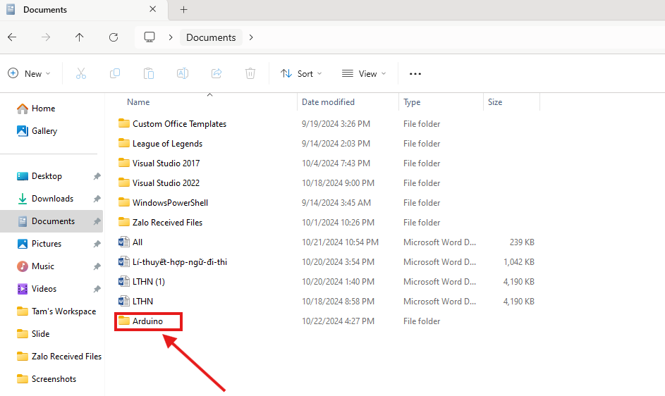
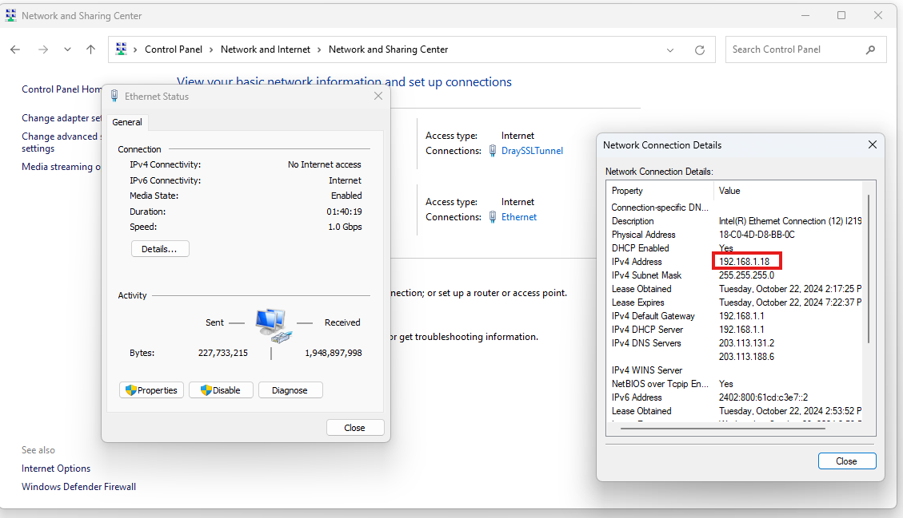

# 🌟 Dự Án Quản Lý Đỗ Xe Thông Minh 🌟

## 📜 Giới Thiệu

Dự án "Quản Lý Đỗ Xe Thông Minh" nhằm xây dựng một hệ thống thông minh để quản lý không gian đỗ xe. Hệ thống này kết hợp công nghệ **Node.js** cho phần backend, **React.js** cho phần giao diện người dùng, và **ESP8266** cho việc giao tiếp với các cảm biến đỗ xe. Mục tiêu là tối ưu hóa việc sử dụng không gian đỗ xe và cung cấp thông tin thời gian thực về tình trạng các chỗ đỗ.

---

## 🏗️ Kiến Trúc Hệ Thống

### 1. Phần Cứng

- **ESP8266**: Thiết bị nhúng kết nối với cảm biến khoảng cách để phát hiện tình trạng chỗ đỗ xe. ESP8266 gửi dữ liệu này đến server qua giao thức HTTP hoặc MQTT.
- **Cảm Biến Khoảng Cách**: Đo khoảng cách và xác định trạng thái của các chỗ đỗ xe.

### 2. Phần Mềm

- **Server (Node.js)**: Xử lý các yêu cầu từ ESP32, quản lý cơ sở dữ liệu, và cung cấp API cho giao diện người dùng.
- **Giao Diện Người Dùng (React.js)**: Hiển thị tình trạng các chỗ đỗ xe và cung cấp các công cụ quản lý cho người dùng và quản trị viên.

---
### 3. Hướng dẫn sử dụng
#### 3.1 Phần cứng
- **Yêu cầu**: Cài đặt Arduino IDE và giải nén file libs vào thư mục Arduino trong document




- Triển khai phần cứng
- Kết nối với một mạng wifi giữa máy tính cá nhân => lấy ssid và password cùng địa chỉ ip thay vào code esp



- Ví dụ

```c++
  const char* ssid = "Akasuza";
  const char* password = "987654321";
  const char* ipAd = "192.168.130.89";
  const int port = 3000;
```
- Cài driver của esp8266 và nạp code

#### 3.2 Phần mềm

##### 3.2.1 Cách 1

- Cài đặt mongodb >v7
- Cài đặt nodejs v20
- mở 1 terminal trong destop và chạy các lệnh sau

```bash
git clone https://github.com/Horob1/parking-lot-arduino-server

cd parking-lot-arduino-server

npm run i

npm run dev
```
##### 3.2.1 Cách 2
- Cài docker 
- mở 1 terminal trong destop và chạy các lệnh sau
```bash
git clone https://github.com/Horob1/parking-lot-arduino-server

cd parking-lot-arduino-server

docker-compose up --build
```